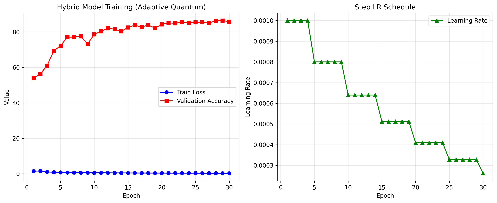

# Quantum-Enhanced Image Classification

## Overview
This project explores the integration of adaptive quantum optimization into deep learning for image classification. It compares classical CNNs (Adam optimizer) with hybrid quantum-classical models using adaptive quantum enhancement, focusing on the CIFAR-10 dataset.

## Features
- Classical CNN and ResNet-20 architectures for CIFAR-10
- Hybrid quantum-classical model with adaptive quantum enhancement
- Step learning rate scheduler with customizable parameters
- Automatic saving of results and plots in organized directories
- Evaluation metrics: accuracy, F1 score, recall, confusion matrix
- Easy-to-read training logs and comparison plots

## Directory Structure
```
CNN_implementation/
├── data/                # CIFAR-10 dataset
├── results/
│   ├── images/          # Training and comparison plots
│   └── npy/             # Saved metrics and training logs (.npy)
├── train_adam.py        # Adam-only (classical) training script
├── train_hybrid.py      # Hybrid (quantum-enhanced) training script
├── compare_adam_hybrid.py # Script to compare results
├── quantum_cnn.py       # Model definitions (ResNet-20, QuantumEnhancedResNet20, etc.)
├── adam_cnn.py          # Classical CNN and trainer
├── quantum_optimizer.py # Quantum optimizer logic
├── requirements.txt     # Python dependencies
└── README.md            # Project documentation
```

## Setup
1. **Install dependencies:**
   ```bash
   pip install -r requirements.txt
   ```
2. **Download CIFAR-10 dataset:**
   The scripts will automatically download CIFAR-10 to the `data/` directory if not present.

## Usage
- **Train Adam-only model:**
  ```bash
  python train_adam.py
  ```
- **Train Hybrid (Quantum-Enhanced) model:**
  ```bash
  python train_hybrid.py
  ```
- **Compare results:**
  ```bash
  python compare_adam_hybrid.py
  ```

All results and plots will be saved in the `results/` directory.

## Results & Visualizations

Below are example visualizations generated by the training and comparison scripts. These plots are saved in the `results/images/` directory.

- **Adam Training Results**
  
  
  
  This plot shows the training and validation accuracy/loss curves for the classical CNN trained with the Adam optimizer.

- **Hybrid (Quantum-Enhanced) Training Results**
  
  
  
  This plot shows the training and validation accuracy/loss curves for the hybrid quantum-classical model.

- **Adam vs Hybrid Comparison**
  
  
  
  This plot compares the performance metrics (such as accuracy or loss) between the classical and quantum-enhanced models.

## Citation
If you use this project or its results in your research, please cite:

> Quantum-Enhanced Image Classification (2024)

---

For questions or contributions, please open an issue or pull request. 